The *Loom UI* is the browser-based management interface for a Loom server. It is a single-page
application (React, Vite and Material UI) that is *bundled into the Loom server itself* — no separate
deployment is required. Everything you can do through the link:../loom/rest-api/[REST API] — browsing
assets, chatting with the AI agent, authoring pipelines, managing users, roles and API keys — is
available from the UI.

The screenshots below are taken from the link:../getting-started/[demo container], which ships with a
pre-seeded database so every screen has real content.

[TIP]
====
Start the demo container and open `\http://localhost:8092/ui/` in your browser. Sign in with the default
demo credentials *admin* / *finger*. See link:../getting-started/[Getting Started] for the one-line
`docker run` command.
====

== What the UI Offers

The collapsible left navigation groups every screen into three sections — *AI*, *Content* and
*Management* — so it is always clear whether you are steering the agent, working on media, or
operating the installation.

*AI*

* *Chat* — a conversational assistant with live references to your assets, tasks and pipelines
* *Chat Sessions* — durable, publishable records of past conversations, with the context and skill
  versions they ran with
* *Skills* — versioned instruction packages the chat agent can apply per conversation
* *Memory* — browse and edit the scoped markdown notes the agent reads and writes

*Content*

* *Search* — one search box above the navigation that looks across every kind of content at once
* *Library* — browse assets grouped into libraries
* *Assets* — grid/list browser with search, status and type filters, plus a rich per-asset detail view
* *Uploads* — multi-file drag-and-drop ingest with per-file progress that keeps running in the background
* *Collections* — organise assets into colour-coded collections
* *Tasks* — a Kanban-style task board with priority, status, due dates and per-asset tasks
* *Detection* — review face, object and LLM detections; manage face clusters and persons
* *Tags* — manage tags grouped by collection
* *Workflow* — fullscreen, keyboard-driven bulk review: <<rating-and-tagging,rating and tagging>>,
  the <<reviewing-duplicates,duplicate review queue>> and
  <<reviewing-detections,confirming what a model found>>

*Management*

* *Asset Pools* — storage pool management and replication
* *Pipelines* — a visual pipeline editor with versioning and side-by-side version diffs
* *Cortex* — live monitoring of connected Cortex worker daemons
* *Monitoring* — rolling metrics dashboards
* *Spaces* — tenant/project separation
* *Indices* — the state of the search, face and duplicate indices, with reindex and sync controls.
  See link:../loom/search-indices/[Search Indices]
* *Memory Denylist* — regex guardrails for what the agent may never store
* *ACL* — a sub-group holding *Users*, *Groups*, *Permissions*, *API Keys* and *Blacklist*, i.e. every
  screen that decides who may do what

== Your First Steps

A brand-new Loom instance starts out empty, and the UI is built to guide you through that first hour
rather than show you blank screens.

* *A personal welcome* — starting a new conversation greets you by name and explains, in one line,
  what the agent can do for you. The greeting disappears as soon as you send your first message.
* *Guided empty pages* — every feature page (Assets, Library, Collections, Tags, Tasks, Skills,
  Asset Pools) shows a large icon, a short explanation of what the feature is for, and a single button
  that creates the first element — upload your first asset, create your first collection, write your
  first skill, and so on.

Once a page has content, the empty state is replaced by the regular browser; if a search or filter
returns nothing, you get a distinct "no matches" hint instead, so an empty result is never confused
with an empty feature.

[#chat]
== Chat & AI Agent

The landing screen is the Loom Agent chat. Ask questions in natural language and the agent works across
your assets, collections, tasks and pipelines. A context panel on the right surfaces recent assets,
active tasks and collections, and past conversations are listed for quick recall.

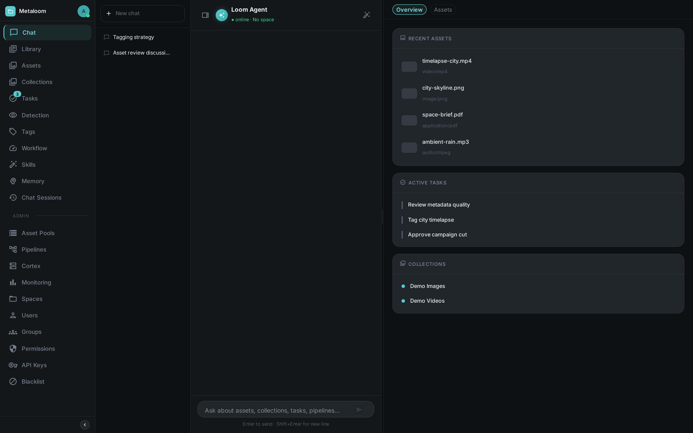

=== Chat Sessions

A conversation can be captured as a *chat session*: a named, describable record that survives the chat
itself. Publishing a session makes it available as *context* for later conversations — a new session can
pull in another session's chat history, its skills, or its coding-sandbox filesystem, each toggled
separately. Sessions also pin the exact skill versions they ran with, so a shared session stays
reproducible after the underlying skills move on.

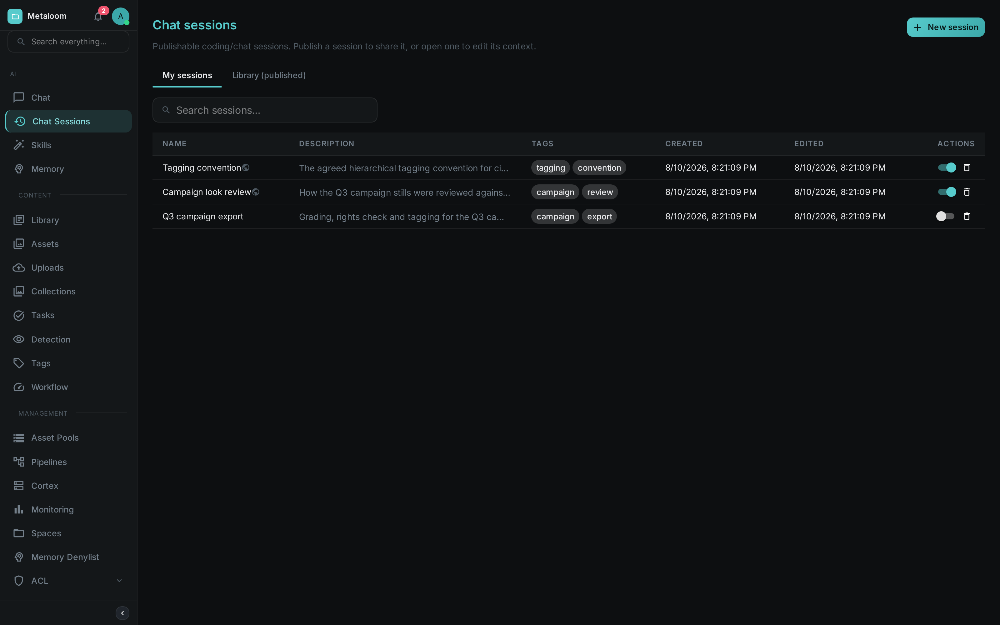

=== Skills

Skills are versioned, publishable instruction packages that the agent can apply on a per-conversation
basis. Your own skills live under *My skills*; shared skills are installed from the *Library*.

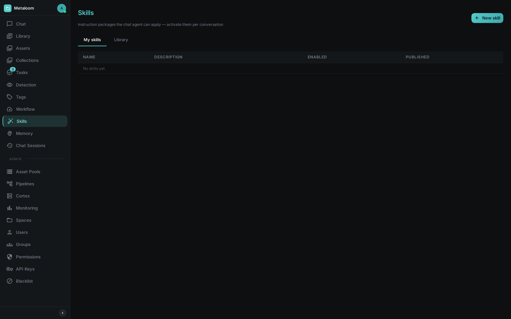

=== Agent Memory

The agent keeps a scoped, markdown-based memory bank that it can read and write across conversations.
The memory view lets an administrator browse and edit those notes; the agent sees it as a read-only
`/memory` folder.

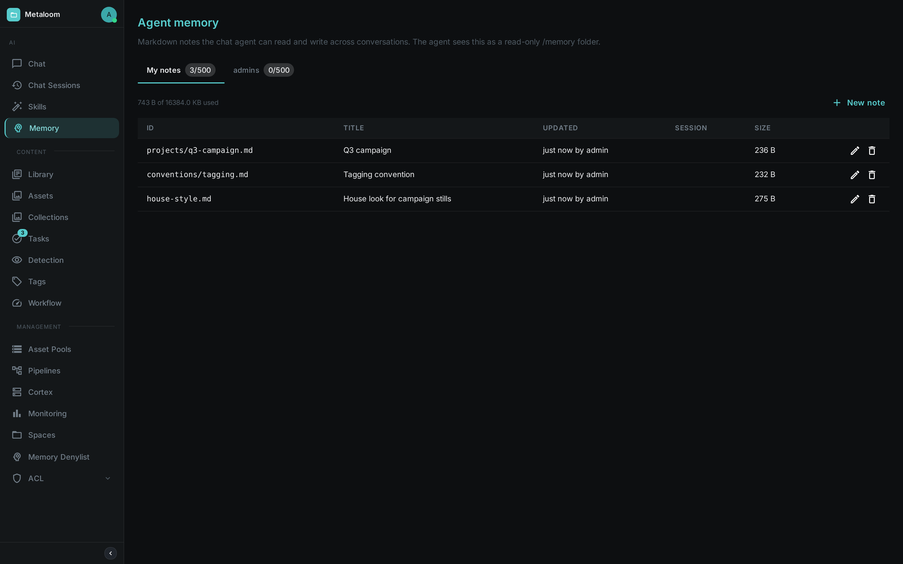

[#assets]
== Search

The search box sits at the top of the left navigation and is available from every screen. Unlike the
filter boxes inside individual screens — which narrow the list you are already looking at — this one
queries the whole installation: asset filenames and metadata, transcript text, tag and collection
names, annotations, people and libraries, all in a single pass.

Start typing and suggestions appear after the second character. Press *Enter* to open the full results
page, where each hit shows what kind of thing it is and a short excerpt with your search terms
highlighted. Transcript hits carry the timecode where the phrase was spoken. Selecting a result takes
you to the asset or the screen that holds it.

=== Refining a Search

The results page offers three ways to narrow what you get back:

* *Kind* — chips for assets, transcripts, tags, annotations, people, collections, libraries and
  clusters. Pick one or several; picking none searches everything you are allowed to see.
* *Suggested filters* — file type, kind and language chips generated from the results themselves,
  each showing how many matches it accounts for.
* *Sort* — by relevance (the default), newest, oldest, name or size.

Active filters are listed together above the results so you can always see what is being excluded and
remove it in one click.

=== Search Syntax

The search box understands three operators, which can be combined freely:

[cols="1,3"]
|===
| Syntax | Meaning

| `"quarterly update"`
| Text in double quotes matches only where those words appear together, in that order.

| `dividends or championship`
| `or` between two terms matches documents containing either one. Without it, terms are combined —
  a document has to contain all of them.

| `quarterly -podcast`
| A leading hyphen excludes matches. This example finds documents about the quarterly update but
  leaves out anything mentioning the podcast.
|===

Punctuation that is not one of these operators is simply treated as text, so a stray quote or bracket
never turns into an error.

[NOTE]
====
Search results respect your permissions. If your account cannot read a particular kind of content,
those results are left out and a note above the results says so — rather than silently returning less
than you asked for.
====

=== Searching by Meaning

If your administrator has enabled it, the results page offers a second and third way to search,
shown as *Lexical*, *Semantic* and *Hybrid* next to the search box. If you do not see those buttons,
only the word matching described above is available on your installation.

* *Lexical* is the default and the one described above: it finds the words you typed.
* *Semantic* finds material that is _about_ what you typed, whether or not it uses the same words.
  Searching for `bicycle` will turn up a clip whose transcript only ever says "cycling", and a
  search for `winter holiday` can surface footage described as "snow, cabins and mulled wine".
* *Hybrid* runs both and merges the two rankings. Material that both agree on rises to the top.
  This is usually the one you want: it keeps the precision of an exact word match while still
  catching the things worded differently.

A semantic result has no highlighted excerpt, because there is no matching word to highlight — it is
marked as a meaning-based match instead. Result counts are approximate in these two modes: both
rankings are cut off at a fixed depth, so the number shown describes the best matches rather than
every document in the catalogue.

Semantic search reads the text Loom holds about an asset — transcripts, extracted text, captions,
tags and filenames. It cannot yet find a photo purely from what is depicted in it if nothing has ever
been written or transcribed about that photo.

[NOTE]
====
Newly added material becomes findable by meaning a short time after it is imported, because each item
has to be processed once before it can be matched this way. Word search is available immediately. An
administrator can see how many items are still waiting.
====

=== When Search Is Turned Off

Search is optional, and an administrator can disable it or point Loom at a search backend that is not
running. When that happens the search box does not appear at all, and the search page explains which
backend is configured and why it cannot answer. Every other part of Loom keeps working normally — a
search outage never takes the rest of the application with it.

== Assets

The asset browser shows every asset with search, status and type filters and switchable grid/list and
card-size views. Videos, images, audio and documents are all represented.

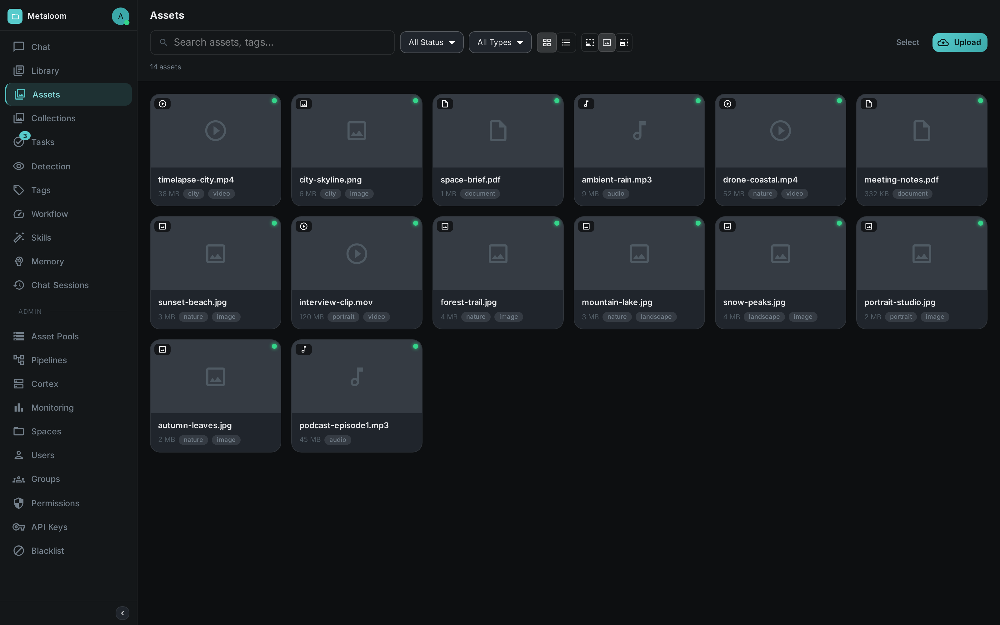

Opening an asset reveals the detail view: media preview, a timeline with markers, tags and metadata, and
tabs for comments, annotations and reactions.

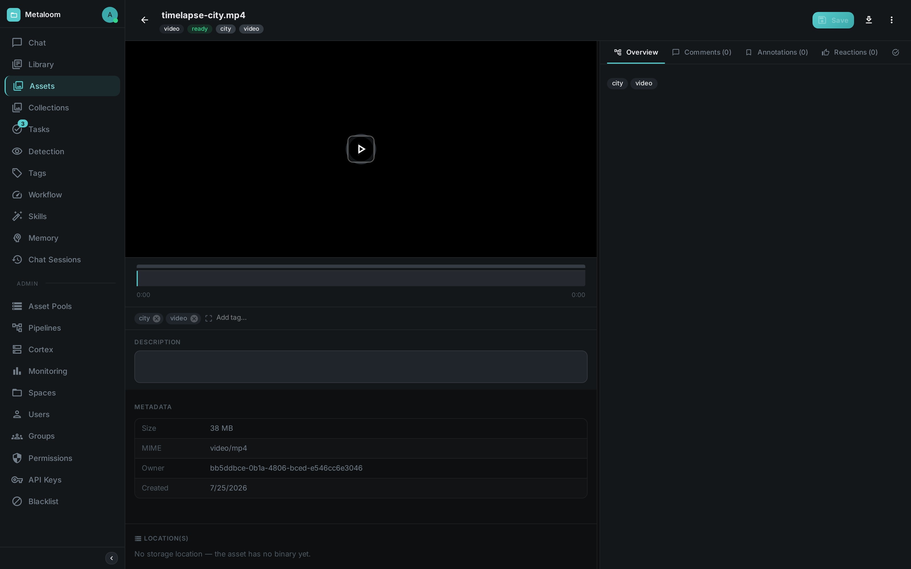

=== Uploads

The *Uploads* screen is the place to bring media into Loom. Drag a whole selection of files onto the
drop area, or click it to pick them — there is no one-file-at-a-time limit.

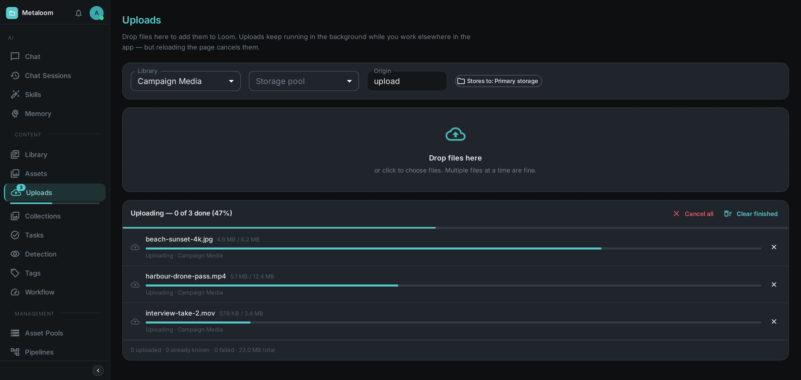

==== Choosing where the files land

Every upload has to land in a *library*, which you choose before adding files. The library also decides
where the bytes are physically stored, and the chip beside the selectors names that destination — *Stores
to: Primary storage* above — so there is never any doubt about where a file went. Administrators
additionally get a *storage pool* selector to send a particular batch somewhere else — an archive bucket,
say — without changing the library itself; the chip then names the pool you picked instead.

The *Origin* field is a free-text label recorded with each asset, describing where the material came
from. It defaults to `upload`; change it to something like `client-handoff` or `shoot-2026-08` and the
whole batch is tagged with it.

==== Watching a batch run

Loom transfers *three files at a time* and starts the next one as soon as a slot frees up, so a large
selection queues up rather than competing for the same connection. Files still waiting are listed as
*Waiting* until their turn comes.

Each file gets its own progress bar and the bytes sent so far, and the bar across the top of the list is
the progress of the batch as a whole — weighted by file size, so a single large file is not drowned out
by a handful of small ones. A file can be cancelled on its own with the *✕* beside it, or the whole batch
with *Cancel all*.

Anything that fails says why in place of its status line and offers a retry, so a failed upload never
means picking the file again; *Retry failed* puts every failure back in the queue at once. Uploading the
same content twice is not an error either: Loom recognises content it already holds and links it to the
existing asset instead of creating a duplicate, and the row says so rather than reporting a problem.
*Clear finished* tidies away everything that has settled and leaves whatever is still running alone.

[NOTE]
====
A bar reaches 100% when the last byte has been *sent*. The server still has to hash and store the file
after that, so a large upload pauses briefly at full before it turns green. That pause is the server
finishing its work, not a stalled transfer.
====

==== Uploads keep running while you work

Uploads are not tied to the screen that started them. Leave it and the *Uploads* entry in the navigation
carries a count of what is still in flight plus a thin progress bar, which is the ambient signal that
work is happening somewhere behind the page you are on:

// Width pinned: this one is a 240px-wide crop of the navigation rail, and left to fill the column
// it renders at twice the size of the full-window screenshots around it.
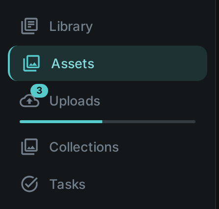

A short message tells you when the batch finishes, how many files were already known, and whether
anything failed. The upload dialog in the asset browser feeds the same queue, so a batch started there
behaves identically and shows up in the same place.

Reloading the browser page is the one thing that cancels an upload in progress — the files only exist in
the page until they have been sent — so the application warns you before that happens.

=== Library

Assets can be organised into libraries. The library view provides a per-library selector and an asset
grid that previews the stored image binaries; formats a browser cannot decode — video, audio,
documents — keep their type icon.

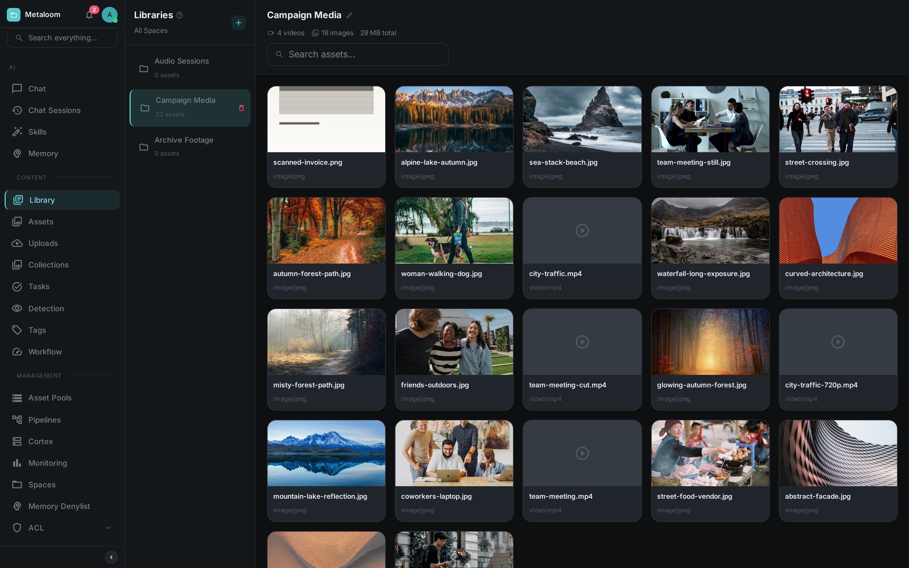

=== Tags

Tags are managed in a tree grouped by collection, with drag-to-move and inline creation.

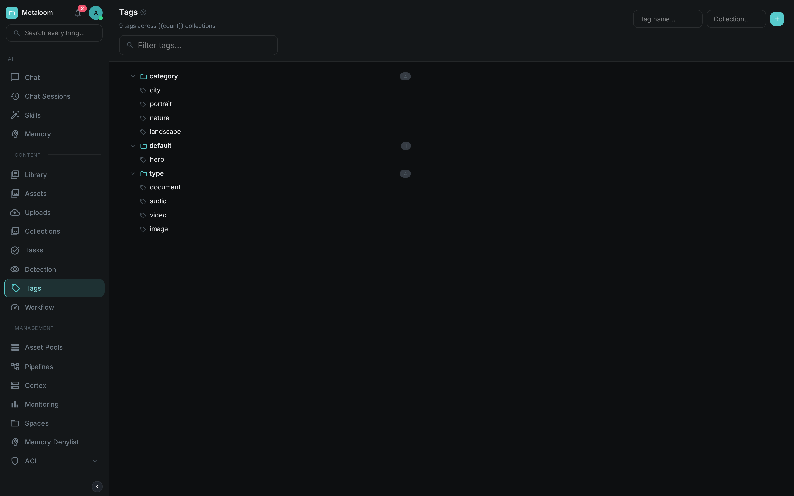

=== Tasks

Work is tracked as tasks with a priority, a status and a due date. A task can be attached to the asset
it is about, in which case it also shows up in the *Tasks* tab of that asset's detail view.

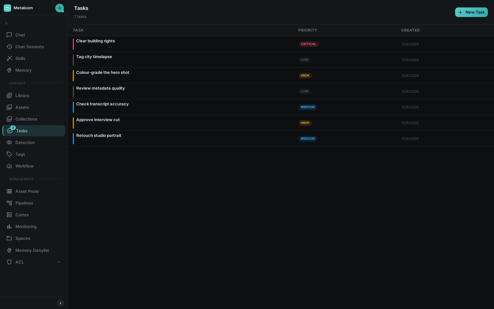

==== Assigning work

A task can be assigned to individual people, to whole groups, or to any mix of the two. Pick the
assignees when you create the task, or add and remove them later from the edit panel. Assignees appear
as avatars on the task board and on the asset the task belongs to.

Assigning to a group does not freeze who is in it. The group's current members are responsible for the
task, so somebody who joins the team afterwards inherits the work without anyone having to reassign it.

Everyone you assign is told about it — see <<notifications>>.

[#notifications]
=== Notifications

The bell at the top of the sidebar is your inbox. It carries a badge with the number of unread entries
and opens a list of what has happened to you:

* a task was assigned to you, or taken off you — directly or through a group you belong to
* a task you are responsible for changed status
* somebody commented on a task you own or are assigned to
* somebody replied to one of your comments
* a pipeline run you started failed

Entries arrive live, without reloading the page, and a short message appears in the corner when one
does. Clicking an entry marks it read and takes you to whatever it is about. You can dismiss entries
one at a time, mark everything as read, or clear the inbox entirely.

You are never notified about your own actions: assigning a task to yourself, or commenting on your own
task, tells nobody. Notifications are private — you only ever see your own.

[#face-review]
=== Face Detection

The Detection view aggregates face, object and LLM detections. The *Faces* tab is where you turn what
the face-detection node found into people you have named.

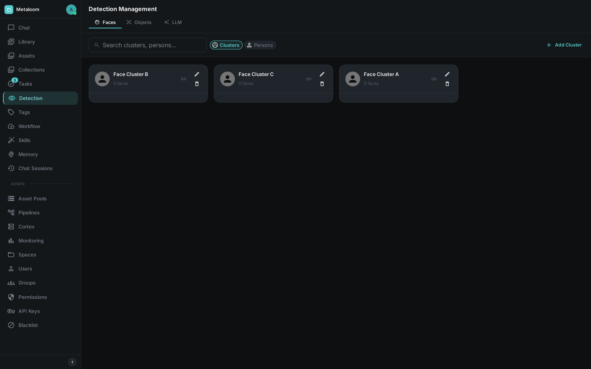

==== Reviewing a group of faces

When link:../nodes/facedetect/[Face Detection] runs over an asset it sorts the faces it found into
groups — one per person it believes is present — and leaves each group *pending*. Nothing is
attributed to anybody until you say so.

Each card shows how many faces are in the group and the actual cropped faces themselves, so you can
tell at a glance whether the grouping is right before deciding anything. From there you either
confirm the group onto a person — somebody already in your list, or a new one created on the spot —
or reject it if it is not a person worth keeping.

Confirming is a real, saved decision, not a view setting: it survives reloading the page, and it
survives the asset being processed again. Re-running face detection updates the boxes and vectors and
leaves your verdicts untouched, so a group you confirmed last month is still confirmed afterwards.

==== What the grouping does and does not mean

Faces are grouped **within a single asset**. Confirming a group means "this person appears in *this*
video", not "the software now recognises this person everywhere". The same person in a second video
comes back as a separate group with no memory of the first, and you confirm it again. Recognising
somebody across the whole library is a larger job and is not part of this yet.

A person's page lists every group confirmed to them, which is how you see where somebody appears
across your material.

==== Face images stay in your deployment

The cropped faces on these cards were cut by the detection node and stored by your own installation.
Face images and the vectors derived from them are biometric data; they are never fetched from, or
sent to, any outside service.

[#rating-and-tagging]
=== Rating and Tagging at Keyboard Speed

*Workflow → Rating* and *Workflow → Tagging* are for working through a set of assets one keystroke
at a time. Press `1` to `9` (and `0` for ten) to rate the asset in front of you; type a word and
press Enter to tag it. The next asset is always one arrow key away.

Both decisions are saved the moment you make them, and both are yours: your rating is your own, and
a colleague rating the same asset does not overwrite it.

The tag box offers the tags your instance already uses, so the same idea does not end up spelled
three ways. You are not limited to that list — type a word that is not in it and it becomes a new
tag.

Two things are worth knowing about what you see on arrival:

* An asset that already carries a rating or curated tags says so, so you can move past work somebody
  has already done rather than redoing it.
* Tags a pipeline attached are shown outlined, with a note of which step attached them and how sure
  it was. They have no remove button here — undoing what a pipeline decided is a deliberate act, and
  it belongs on the asset's own page rather than one keystroke away from a review flow.

If a save fails — a lost connection, or a missing permission — the star or the chip visibly goes
back to how it was and a message says so. A screen that looks finished really is.

TIP: Your decisions follow the *file itself*, not where it happens to sit. Assets are identified by
their content, so moving a file to another folder, renaming it, or scanning it again all keep the
rating and the tags it already had.

Decisions made here are not just a record. A pipeline can route on them: see the
link:../nodes/filter/[Filter] node's *Rating* and *Tag* modes for publishing what reviewers rated
highly, and finding what nobody has looked at yet.

[#reviewing-duplicates]
=== Reviewing Duplicates

*Workflow → Dedup* is the queue of near-duplicate videos that a link:../nodes/dedup/[deduplication]
pipeline has found and nobody has decided on yet. Nothing has been moved at this point: the search
only proposes, and your decision is what allows anything to happen to a file.

Each entry shows one group. The file the system suggests keeping is framed in green at the top, and
the candidate duplicates sit below it. For every file you get:

* its *name*, so you can recognise where it came from
* its *size* — the usual reason to disagree with the suggested keeper
* an *Incomplete* marker when the file looked truncated at the time it was found, which is what a
  convincing "duplicate" sometimes turns out to be
* a *score*, from 0 to 1, saying how close the match is

A preview is shown for anything the browser can display. Most candidates are video, which has no
preview, so those show a placeholder and you decide on the numbers.

Work through the queue with the keyboard:

[options="header",cols="1,3"]
|===
| Key | Action
| `Y` | Confirm — the duplicates in this group may be cleared away
| `N` | Reject — leave these files alone, permanently
| `←` `→` | Move between groups
| `F` | Fullscreen
|===

If you disagree with which file should be kept, press *Keep this one* on the file you would rather
keep. That only changes the choice; it does not decide the group, so you still confirm or reject
afterwards.

Every decision is saved as you make it. If saving fails — a lost connection, or a missing permission
— the entry visibly goes back to undecided and a message says so, so a queue that looks finished
really is.

Rejecting a group is final in a useful way: the next deduplication run will not propose the same set
of files again, so the queue does not refill with decisions you have already made.

TIP: Confirming a group does not itself move anything. The clean-up happens the next time a pipeline
with the apply step runs over those files, and it re-checks the file being kept before it touches
anything.

NOTE: Opening this queue needs the *Deduplication → READ_DEDUP* permission, and deciding a group
needs *UPDATE_DEDUP*. Both are granted in the *Permissions* screen under *Administration*.

[#reviewing-detections]
=== Reviewing What a Model Found

*Workflow → Objects* is the queue of things an object-detection pipeline believes it found and
nobody has confirmed yet. A detection model is right most of the time and confidently wrong the
rest of it, so what it produces is a proposal until somebody says otherwise.

Each box is drawn over the asset and listed below it with the class the model assigned and how sure
it was. Select a box and decide:

[options="header",cols="1,3"]
|===
| Key | Action
| `Y` | Confirm — there really is one of these here
| `N` | Reject — a false positive
| `↑` `↓` `Tab` | Move between boxes
| `←` `→` | Move between assets
|===

Confirmed boxes turn green, rejected ones fade and are marked as such, and anything still undecided
stays amber — so at a glance you can see how far through an asset you are.

There is a third answer, and it is the useful one: the box is in the right place but the class is
wrong. Correcting the class still counts as a confirmation, because the model did find something
there. What the model originally said is kept alongside your correction rather than replaced — that
record is what makes the reviewed set worth anything as training material later.

A rejected detection is kept too, rather than deleted. It is the record that the model was wrong
about this particular spot, which is also what stops the next run offering you the same box again
as though it were new.

Decisions are saved as you make them, in batches, so a fast run of keystrokes is not slowed down by
one save per box. If saving fails, the boxes visibly go back to undecided and a message says so.

TIP: Re-running the same detection pipeline over an asset you have already reviewed does not undo
your work — the pipeline updates its own boxes and leaves your verdicts alone. Upgrading to a
different version of the detection model *does* return those boxes to the queue: the new model may
have found something different in the same place, so an old verdict is no longer a safe answer to a
question that has changed.

NOTE: Opening this queue needs the *Detection → READ_DETECTION* permission, and deciding a box needs
*UPDATE_DETECTION*. Both are granted in the *Permissions* screen under *Administration*.

[#pipeline-editing]
== Pipeline Editing

Pipelines are authored on a React Flow canvas: drag nodes from the palette, wire typed handles, set
PASS/REJECT/ANY edges, validate the graph and run it. An inspector on the right shows metadata and run
history, and the JSON tab exposes the raw definition.

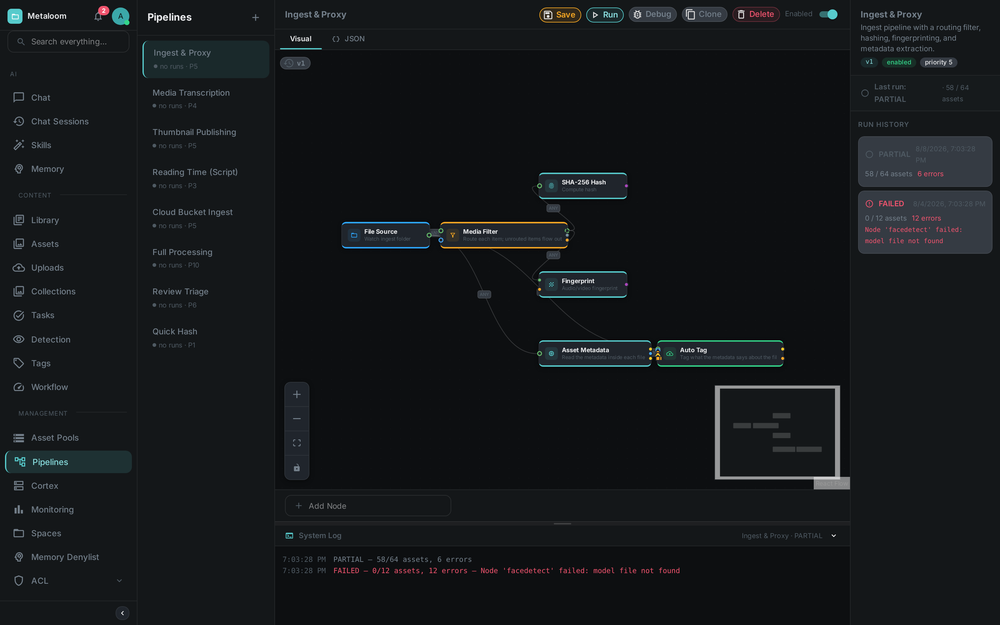

=== Debugging a Run

A *Debug* toggle in the toolbar turns the same canvas into a debugger. Each node then shows live
counters, and picking a file from the run history paints onto every node the values it emitted for
*that* file — a hash, a transcript, a thumbnail you can actually look at. Clicking any of them opens
it full size.

A dot in each node's left margin halts the run there: the node runs, everything after it waits, and
*Step* then lets one file through at a time. Debug off leaves the editor exactly as it is for
authoring. See link:../pipeline/#debug-mode[Pipeline Mechanism — Debug Mode] for the full walkthrough
with screenshots.

=== Pipeline Versioning

Every save mints a new pipeline version. The version badge opens a history popover where you can review,
restore (copy-forward) or diff any earlier version against the current one.

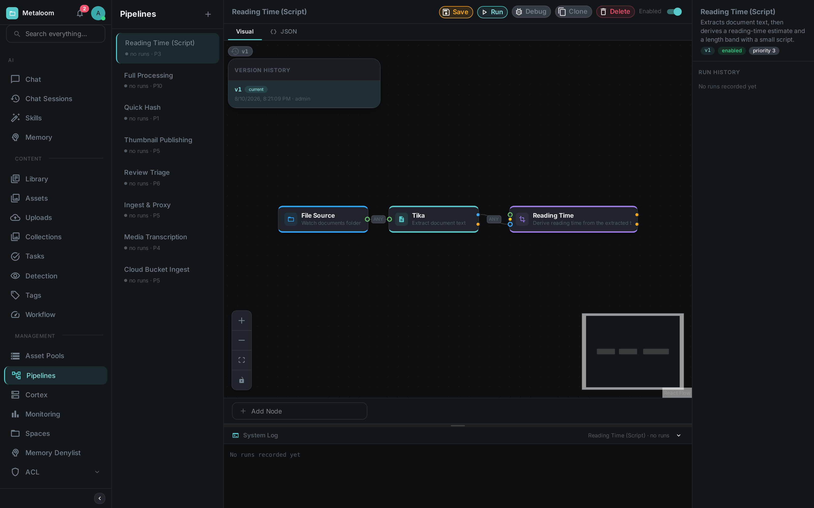

== Cortex Instances

The Cortex view monitors the worker daemons connected to Loom. Each registered worker shows its
online status, host, priority, live CPU/IO/memory metrics, advertised capabilities and the node
kinds it is allowed to run. From here you can pause, resume or forget a worker and edit its node
restrictions. Workers appear automatically once a link:../cortex/[Cortex] daemon registers with the
server.

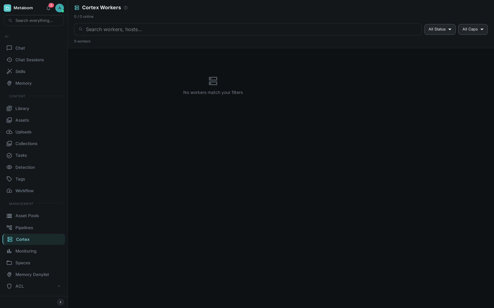

[#monitoring]
== Monitoring

The monitoring area is the operational overview: a row of headline figures — assets ingested, pipeline
runs, average processing latency, storage used, open tasks, agent queries and new annotations — over a
14-day rolling window, followed by the trends behind them. Asset ingestion, pipeline run outcomes
(success / failed / skipped), task backlog, processing latency, storage growth and agent usage each get
their own chart.

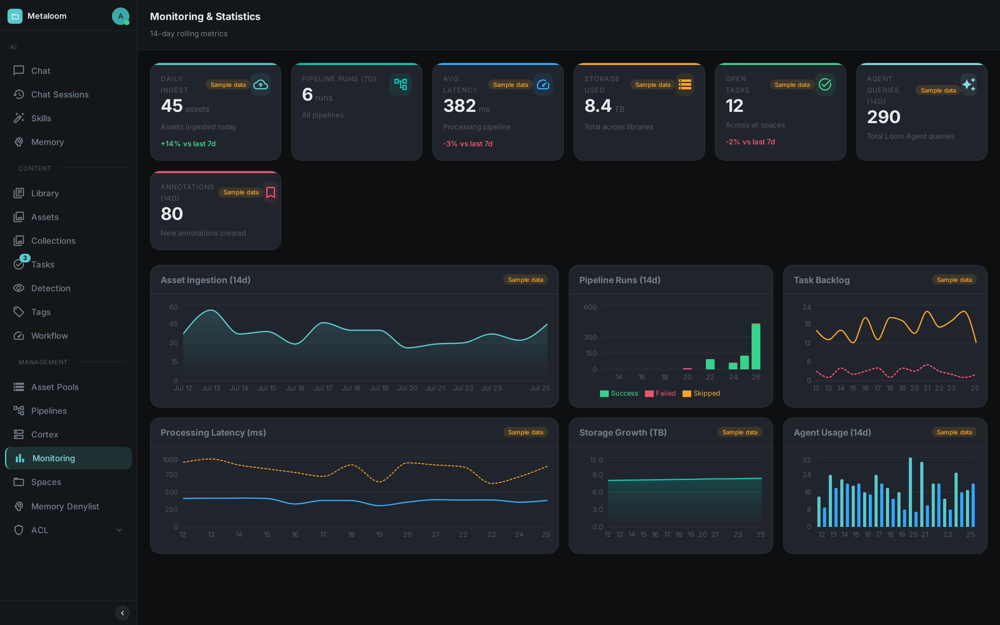

[#administration]
== Administration

Everything that decides *who may do what* lives in the *ACL* sub-group of the Management section.
*Users* manages accounts, status and role assignments.

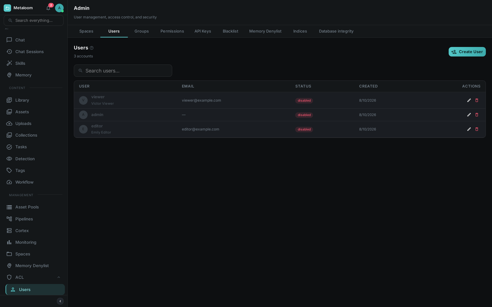

*Permissions* is the access-control (ACL) surface: define roles and toggle fine-grained permissions
across every resource type (assets, annotations, users, and more) in a permission matrix. Each
permission carries a one-line description of what it actually allows, so a role can be assembled
without cross-referencing the API. Roles are assigned to users through groups.

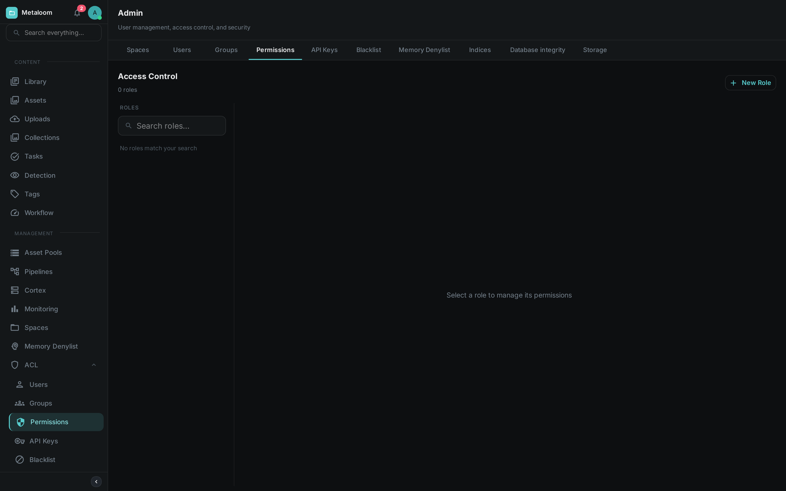

Three things are worth knowing when you assemble a role:

* *A tick is the whole story.* The matrix always saves the role's complete permission set, so
  unticking a box revokes that permission — it is not merely omitted from the update.
* *Changes apply immediately.* Members of the role gain or lose the access on their very next
  request; nobody has to sign out and back in.
* *Permissions are account-wide, not per-object.* Granting *Read asset* lets the role read every
  asset in the instance. To keep a set of media apart, separate it by instance rather than by role.

A role only reaches people once it is attached to a group they belong to. A role with permissions
but no group grants nothing.

*API Keys* generates and revokes long-lived API tokens for programmatic access — see
link:../loom/authentication/[Authentication].

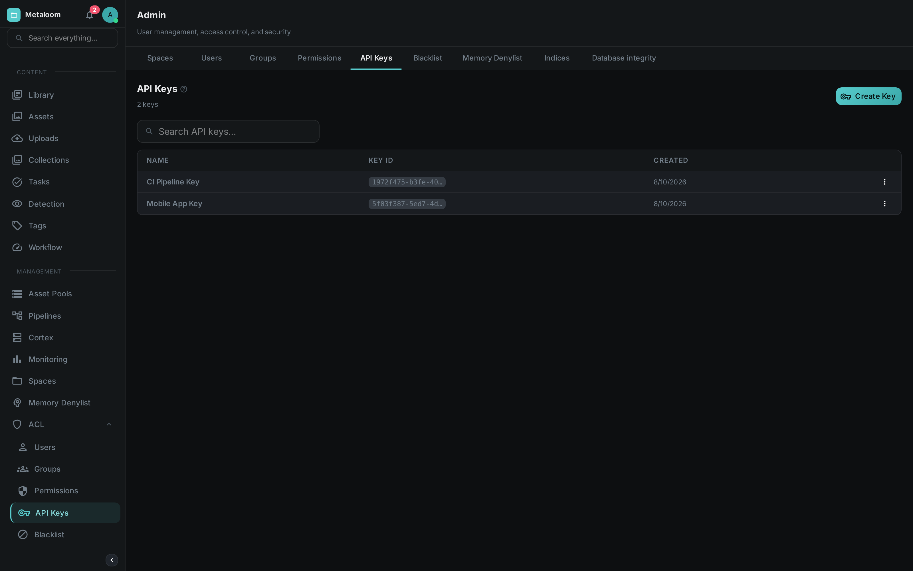

== Related

* link:../getting-started/[Getting Started] — run the demo container and open the UI
* link:../loom/chat/[Chat & AI Agent] — the agent, sessions, skills, memory and coding sandbox
* link:../loom/rest-api/[REST API] — the endpoints the UI is built on
* link:../loom/authentication/[Authentication] — login, tokens and API keys
* link:../pipeline/[Pipeline Mechanism] and link:../nodes/[Nodes] — what the pipeline editor builds
