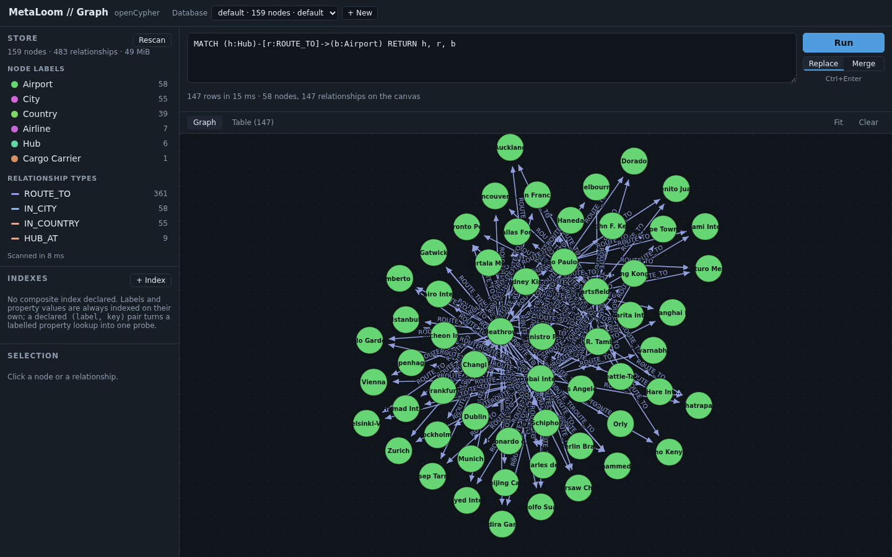
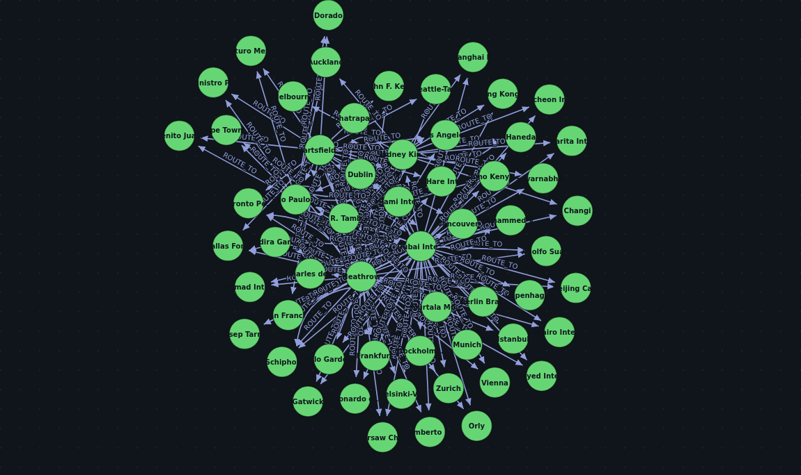
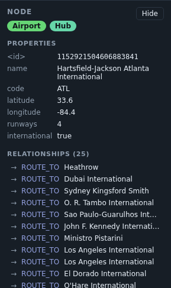
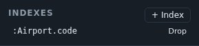
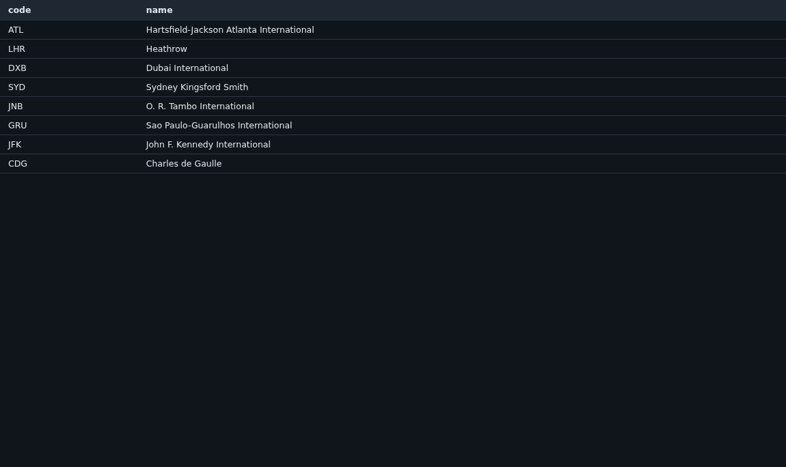

The server ships a browser UI in the same jar. No separate deployment, no separate build: start the server and open
the HTTP port.

[source,bash]
----
java -jar graph-server.jar --demo --allow-write /tmp/demo
open http://localhost:8080
----

== The query editor

Type Cypher, press Ctrl+Enter. Results arrive as both a graph and a table from the same response, and the status line
says how many rows came back, how long the server took, and how much of it reached the canvas.

*Replace* and *Merge* decide what a second query does to the canvas: replace it, or add to what is already drawn.
Merge is what makes exploration work — run a query, click a node, run a query about that node, and keep the context.

A syntax error comes back as a message with a caret under the offending token, because the parser reports a position
and the UI shows it rather than flattening it to "invalid query".

== The graph view

d3-force, with drag and zoom. React owns everything outside the `<svg>` and d3 owns everything inside it; they do not
share state, because a simulation writing into React state would re-render the application on every tick.

Colour is assigned per label, deterministically, so the same label is the same colour across queries and across
sessions.

== The inspector

Click a node or a relationship to see everything it holds: its id, its labels, every property, and its relationships
with their direction and their far end.

The relationship list is the fastest way to navigate a real graph — clicking through it is a traversal, and the
result is the same one a query would give.

== The schema sidebar

Labels, relationship types and property keys, each with a count, so you can write a query against what is actually
there rather than what you remember being there.

This is a *full scan* — O(nodes + edges), and there is no cheaper way to get a truthful answer. Three things keep it
from being a problem: it runs on a worker thread, the result is cached for a minute, and the response says how long
it took so you can see what it cost. On a store large enough for the scan to hurt, the sidebar is the wrong tool and
the cache is what keeps the UI usable.

== Indexes

Declare a composite index on a `(label, property key)` pair, optionally unique, and drop it again.

Declaring one scans the store, so the index is complete when it appears rather than filling in behind you. A unique
one is refused outright if the existing data already breaks it, rather than being recorded as a constraint that is
not true.

== The result table

The same result as the graph, as rows — which is what you want when a query returns scalars rather than nodes.

== A note on what this is not

There is *no authentication* on the port this UI is served from, and none in the UI. Anyone who can reach it can read
every database under the root, and if the server was started with `--allow-write`, change them.
